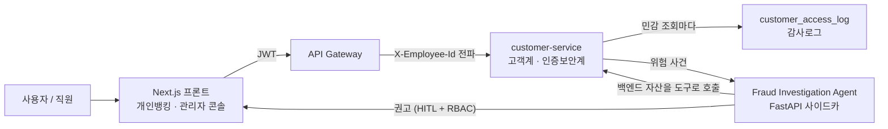
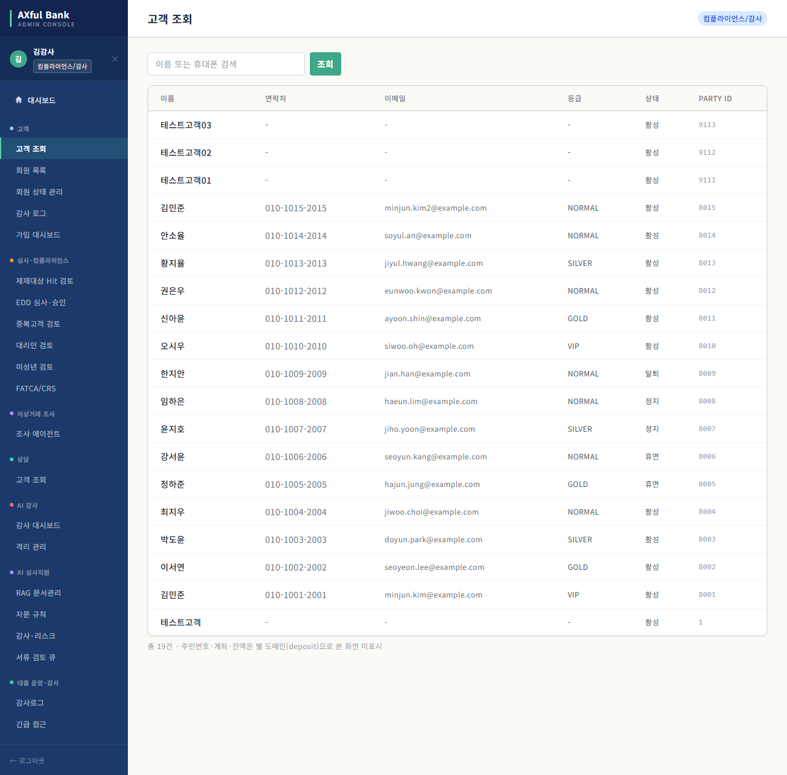
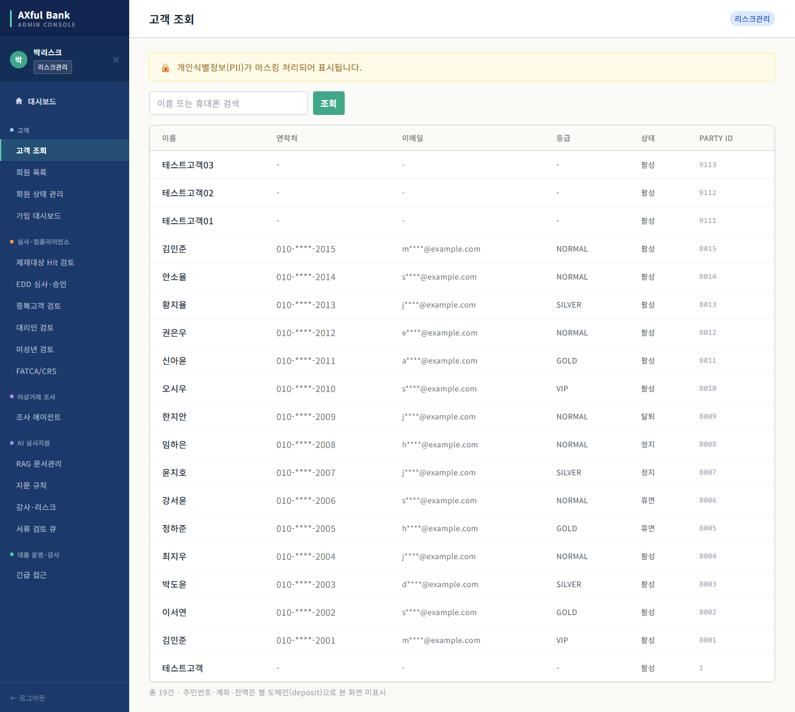
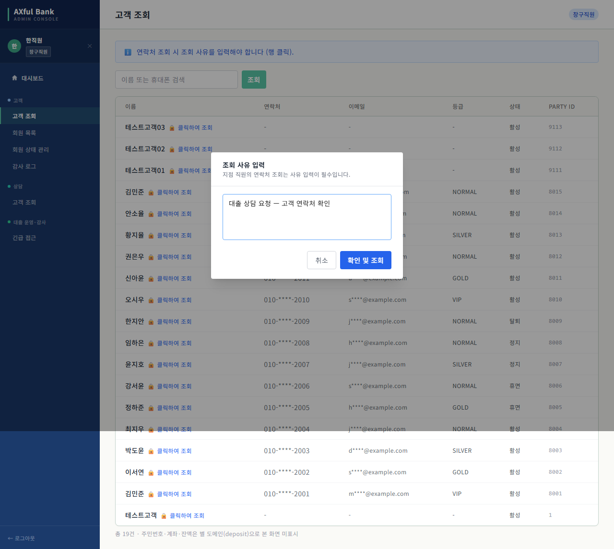
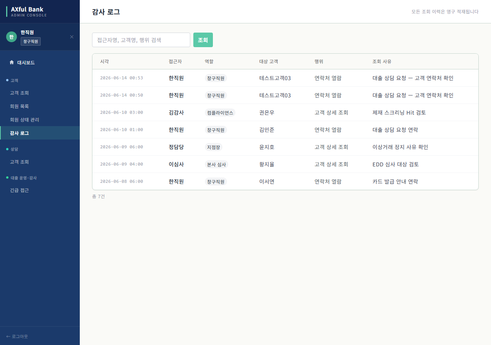

# Internet Banking — 인증보안계 백엔드 · 프론트엔드 · 이상거래 조사 AI 에이전트

> 국민은행을 벤치마킹한 **5인 팀 인터넷뱅킹 프로젝트** 중 **제가 담당한 부분**을 정리한 레포입니다.
> 담당 범위: **프론트엔드 전반 / 백엔드 고객계·인증보안계 / 이상거래 조사 AI 에이전트**
> (백엔드는 원본 Gradle 멀티모듈의 한 서비스라, 이 레포에서는 **소스 열람용**으로 담았습니다.)

---

## 👤 담당 범위 (5인 팀)

| 영역 | 담당 내용 |
|------|-----------|
| **프론트엔드** (고객·인증) | 로그인·회원가입·마이페이지·이체·메인홈, 금융인증서 발급/PIN/QR 인증 UI, 조사 에이전트 콘솔, 고객조회 RBAC(마스킹·조회사유), 백엔드 API 실연동 |
| **백엔드 — 고객계** | 고객·Party 도메인, 디바이스 등록, 마이페이지 |
| **백엔드 — 인증보안계** | 금융인증서(cert)·PIN·간편비밀번호, 로그인·휴대폰 본인확인(mobileauth), 이상거래탐지(FDS), JWT 인증/권한 일원화, 행위자 감사로그 |
| **AI 에이전트** | 이상거래 사건 조사 에이전트(LangGraph) + 책임 기반 트리아지 |

> **범위 안내** — `backend/`(customer-service)·`agent/`는 **본인 담당분만** 발췌했습니다.
> `frontend/`는 통합 동작 시연을 위해 **팀 공용 web 프론트 전체**를 담았으며, 이 중 본인 담당은
> **고객·인증 도메인 화면**(로그인·회원가입·마이페이지·금융인증서·QR/PIN·조사 에이전트 콘솔·고객조회 RBAC)입니다.
> **대출 어드민·AI 심사지원·수신/상품 화면은 팀원(양혜민=대출, 정혜영=수신/상품) 작업**입니다.

---

## 🧱 기술 스택

- **Frontend** — Next.js 14 (App Router) · TypeScript · React 18 · TanStack Query · Axios · Tailwind CSS · shadcn/ui
- **Backend** — Java 17 · Spring Boot 3 · Gradle (멀티모듈) · PostgreSQL 16 · Redis 7 · Flyway · JWT
- **Agent** — Python · LangGraph · FastAPI · Pydantic (LLM: OpenAI / Anthropic, 키는 환경변수 주입)

---

## 🏗 아키텍처

- 빠른 개요: [`docs/architecture.md`](docs/architecture.md)
- **상세 도메인 설계(직접 작성)**: [`docs/customer-auth-architecture.md`](docs/customer-auth-architecture.md) — 시스템 컨텍스트·인증 시퀀스·권한 모델을 본인 Mermaid 다이어그램으로 정리. DDL 설계는 [`docs/customer_ddl_design.md`](docs/customer_ddl_design.md) · [`docs/auth_security_ddl_design.md`](docs/auth_security_ddl_design.md), 주요 의사결정은 [`docs/decisions/`](docs/decisions/).
- **영역별 작업 노트(직접 작성)**: [`인증서 기술스택`](docs/share/cert-tech-stack.md) · [`고객·인증보안계 작업공유`](docs/share/customer-auth-worknote.md) · [`Fraud 에이전트 작업공유`](docs/share/fraud-agent-worknote.md)

---

## ✨ 핵심 구현 포인트

1. **인증·권한 일원화** — 흩어져 있던 역할 어휘를 공통 역할 모델로 통합. 게이트웨이가 JWT에서 행위자(employeeId)를 추출해 `X-Employee-Id`로 백엔드에 전파하고, 민감 조회마다 `customer_access_log` 감사 기록을 남긴다. *"누가 무엇을 봤는지"가 항상 추적된다.*
2. **Party 패턴** — 개인·직원·법인을 `Party` + `Role`로 모델링. "직원 구분"을 `party_type='PERSON'` 같은 꼼수가 아니라 `party_role(EMPLOYEE)` 기반으로 정상화했다.
3. **금융인증서 + 다중 인증** — 인증서 발급/검증, 6자리 PIN, 휴대폰 본인확인(mobileauth), 디바이스 등록, QR 로그인을 한 서비스에서 일관된 규칙으로 처리.
4. **책임 기반 트리아지 (L4~L0)** — 이상거래 알림을 'FDS 이상도 점수'가 아니라 *틀렸을 때 은행이 지는 책임의 무게*로 줄 세운다. **L4**(권리자 적격성 — 사망·후견계좌 무권리자 지급, 은행 직접 배상) > **L3**(법규 위반 — AML·실명법 제재) > **L2**(권한·동의 누락) > **L1**(소비자보호) > **L0**(규정 무관, 이상도만). 12행 결정 테이블이 등급·가중치·처리경로(즉시/가중/NOTIFY)를 강제해 **LLM 비결정성을 우선순위 판정에서 배제**한다. (근거: [`agent/corpus_registry.md §12`](agent/corpus_registry.md))
5. **이상거래 조사 에이전트 (메인)** — 트리아지가 공급한 사건 하나에 5개 공격 시나리오(보이스피싱·계정탈취·자금세탁·내부자·정상)를 **동시에 경합**시키고, *지금 가설을 가장 잘 가르는 도구*를 스스로 골라 호출 → 증거로 가설 재계산 → 책임 등급과 함께 권고. 실제 지급정지/STR은 **분석가 승인(HITL) + RBAC**으로만 실행되고, 에이전트는 권고까지만 한다.

---

## 🎬 데모

### RBAC 차등 접근 + 감사로그 (인증보안계)

같은 고객 목록을 **직원 역할에 따라 다르게** 보여주고, 민감정보 조회는 사유와 함께 감사로그에 영구 기록한다.

| 감사 — 전체 | 리스크 — PII 마스킹 | 창구 — 조회사유 | 감사로그 |
|---|---|---|---|
|  |  |  |  |

- **감사(COMPLIANCE)** → 연락처·이메일 전체 (`010-1015-2015` / `minjun.kim2@example.com`)
- **리스크(HQ_RISK)** → 자동 마스킹 (`010-****-2015` / `m****@example.com`) + "🔒 PII 마스킹" 배너
- **창구(TELLER)** → 연락처 열람 시 **조회 사유 입력 필수** → *누가·언제·무엇을·왜* 봤는지 `customer_access_log`에 기록
- 전체 흐름 영상 + **장면별 설명**: [`docs/demo/`](docs/demo/) (영상 `rbac_demo.webm` + 무엇을 보는지 설명)

> 역할은 게이트웨이가 JWT에서 추출·전파한 `X-User-Role` 기반. **"신원 → 권한 → 감사"가 한 화면에서 증명**된다.

### 이상거래 조사 AI 에이전트

가설 경합 → 도구 선택(이유) → 재계획 → 권고(HITL)의 추론 루프 + 어드민 콘솔 연동.
CLI 트레이스·콘솔 스크린샷·영상은 → [`agent/README.md`](agent/README.md)

---

## 📁 폴더 구조

| 폴더 | 내용 |
|------|------|
| [`frontend/`](frontend) | Next.js 앱 (개인뱅킹 + 관리자 콘솔) |
| [`backend/`](backend) | `customer-service` — 고객계·인증보안계 (Spring Boot, 소스 열람용) |
| [`agent/`](agent) | 이상거래 조사 에이전트 — [상세 README](agent/README.md) |
| [`docs/`](docs) | 아키텍처 문서 |

### 백엔드 도메인 모듈 (`backend/src/main/java/com/bank/customer/`)

`cert`(금융인증서·QR) · `crypto`(주민번호 암호화) · `device` · `fds`(이상거래) ·
`identity`(본인확인) · `login` · `mobileauth` · `party` · `pin` · `banking` · `history`(감사) · `mypage`

---

## ▶ 실행

- **프론트엔드** — `cd frontend && npm install && npm run dev` (백엔드 API 주소는 `.env.local`의 `NEXT_PUBLIC_API_URL`)
- **에이전트** — [`agent/README.md`](agent/README.md) 참고 (`TRIAGE_LLM_PROVIDER=mock`이면 키 없이 동작)
- **백엔드** — 원본 모노레포의 `common`/`libs` 모듈에 의존하므로, 이 레포에서는 **소스 열람용**입니다. 단독 빌드는 지원하지 않습니다.

---

## 📝 비고

- 본 레포는 팀 프로젝트에서 **제 기여분만** 발췌·정리한 개인 포트폴리오입니다.
- 시드/데모 데이터의 주민번호·고객 정보는 모두 **가상의 목업 데이터**이며, 실제 개인정보가 아닙니다.
- 관리자 콘솔 로그인은 백엔드 RBAC를 프론트에서 **시연**하기 위한 데모 게이트입니다(실제 인가·감사는 서버에서 강제).
