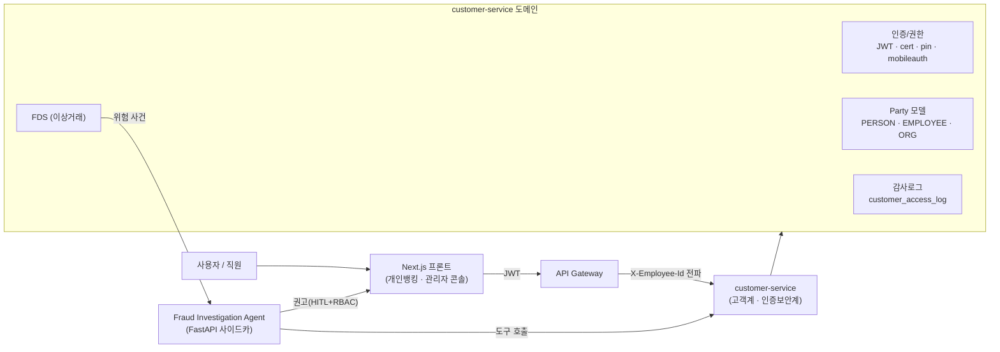
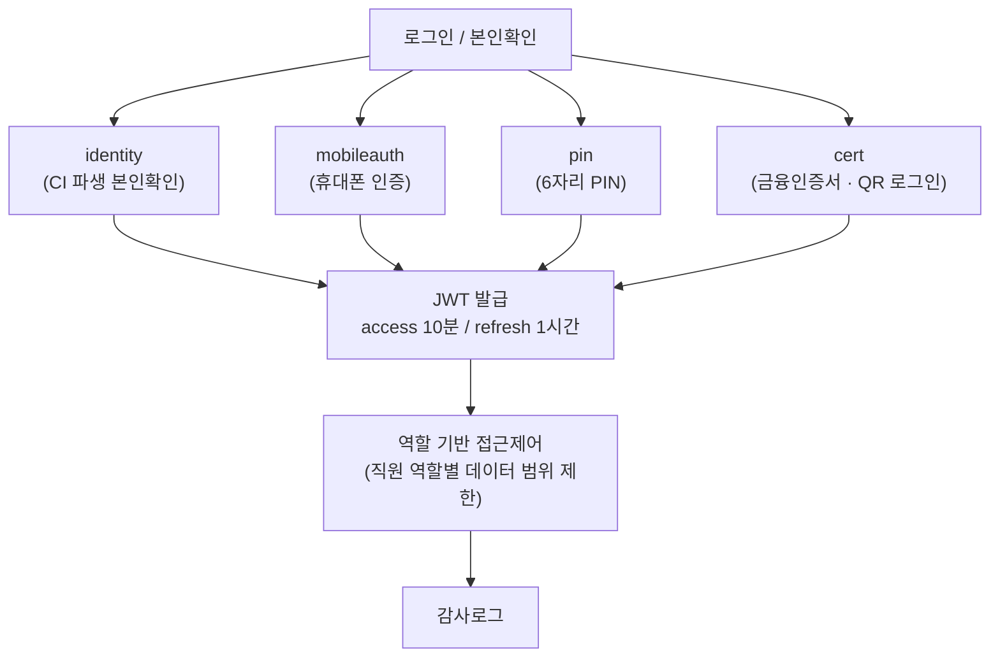
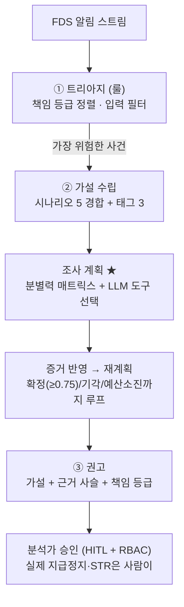

# 아키텍처

담당 3개 레이어(프론트 · 인증보안계 백엔드 · 조사 에이전트)가 어떻게 맞물리는지 정리합니다.

---

## 1. 전체 흐름

**핵심 설계**

- **행위자 추적** — 게이트웨이가 직원 JWT에서 `employeeId`를 꺼내 `X-Employee-Id`로 백엔드에 전파. 모든 민감 조회가 *누가 봤는지*와 함께 `customer_access_log`에 남는다.
- **Party 패턴** — 개인·직원·법인을 하나의 `Party` + `Role`로 모델링. 직원 식별을 데이터 꼼수가 아닌 `party_role(EMPLOYEE)`로 정상화.
- **에이전트는 사이드카** — 조사 에이전트는 백엔드를 대체하지 않고, 백엔드 자산(party·auth·FDS·STR)을 **도구로 호출**하는 별도 서비스. 실제 조치는 사람이 승인.

---

## 2. 인증·권한 (인증보안계)

- 민감정보(주민번호)는 `crypto` 모듈에서 AES-256으로 암호화 저장. 키는 환경변수 주입.
- 액세스 토큰 만료 시 프론트가 refresh로 **자동 갱신 후 원요청 1회 재시도** (좀비 로그인 구간 제거).

---

## 3. 이상거래 조사 에이전트 (3단계 파이프라인)

> 상세 설계는 [`../agent/README.md`](../agent/README.md). 요약하면:

- **고정 워크플로우가 아니다** — 직전 도구 결과가 다음 행동을 바꾼다. 같은 알림도 디바이스가 평소 것이냐에 따라 보이스피싱↔계정탈취로 갈린다.
- **에이전트는 권고만** — 지급정지/STR 같은 실제 조치는 분석가 승인(HITL) + RBAC으로만 실행.
