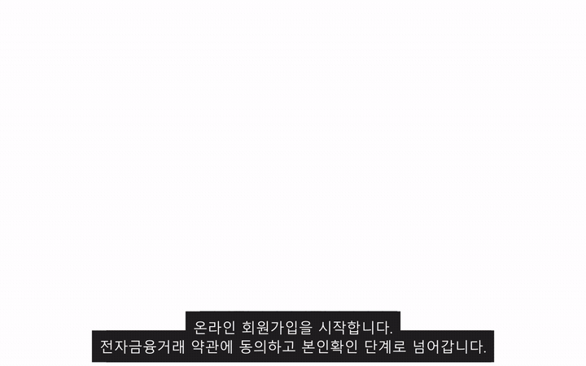

# 데모 영상 — 회원가입·본인확인 → 로그인 (인증·신원확인)

**데모** (약 27초)

> 위 GIF로 바로 재생됩니다. 고화질 원본은 [`auth_demo.webm`](auth_demo.webm)을 내려받아 보세요. 아래는 **장면 설명**.

## 무엇을 보여주나

온라인 고객이 **휴대폰 본인인증(SMS)으로 명의자 본인임을 확인**하고 신규 가입한 뒤, **방금 만든 계정으로 로그인**하기까지를 한 흐름으로 시연합니다. → 인증보안계의 *"신원확인 → 인증"* 출발점.

## 장면 순서

| # | 단계 | 화면에서 일어나는 일 |
|---|---|---|
| 1 | **약관 동의** | 전자금융거래 약관 전체 동의 → 본인확인 단계로 진행 |
| 2 | **휴대폰 본인인증** | 성명·주민등록번호 입력 → 통신사·번호로 인증번호 발송 → **SMS 인증번호 입력으로 명의자 본인확인** (검증 성공 시 `verificationId` 발급) |
| 3 | **정보 입력** | 사용할 **아이디 중복확인** → 인터넷뱅킹 로그인 비밀번호 설정 |
| 4 | **가입 완료** | 본인확인과 함께 온라인고객 가입 완료, 발급된 ID 표시 |
| 5 | **로그인** | 아이디 로그인 탭에서 방금 만든 ID·사용자암호로 인증 |
| 6 | **로그인 완료** | 개인화된 메인 화면 진입 — 인사말·세션 타이머·로그아웃 노출 |

## 보는 포인트

- **신원확인이 인증의 전제** — 휴대폰 본인인증(SMS)으로 명의자 본인임을 확인해야 가입이 진행되고, 그 결과(`verificationId`)가 가입 요청에 함께 전달됩니다.
- **아이디 중복확인 → 가입 제출 시 서버 검증** — 형식·중복을 단계적으로 거릅니다.
- **가입한 계정으로 즉시 로그인** — 발급된 자격증명으로 access/refresh 토큰을 받아 로그인 상태(세션 타이머)로 진입.
- 로그인은 아이디 외에도 **공동·금융인증서 · QR · 간편 PIN** 등 다중 인증수단을 제공합니다(로그인 화면 탭 참조).

> 본 데모의 인증번호는 실 SMS 게이트웨이가 없는 로컬/시연 환경의 **고정 코드**이며, 주민번호·고객 정보는 모두 **가상의 목업 데이터**입니다.
